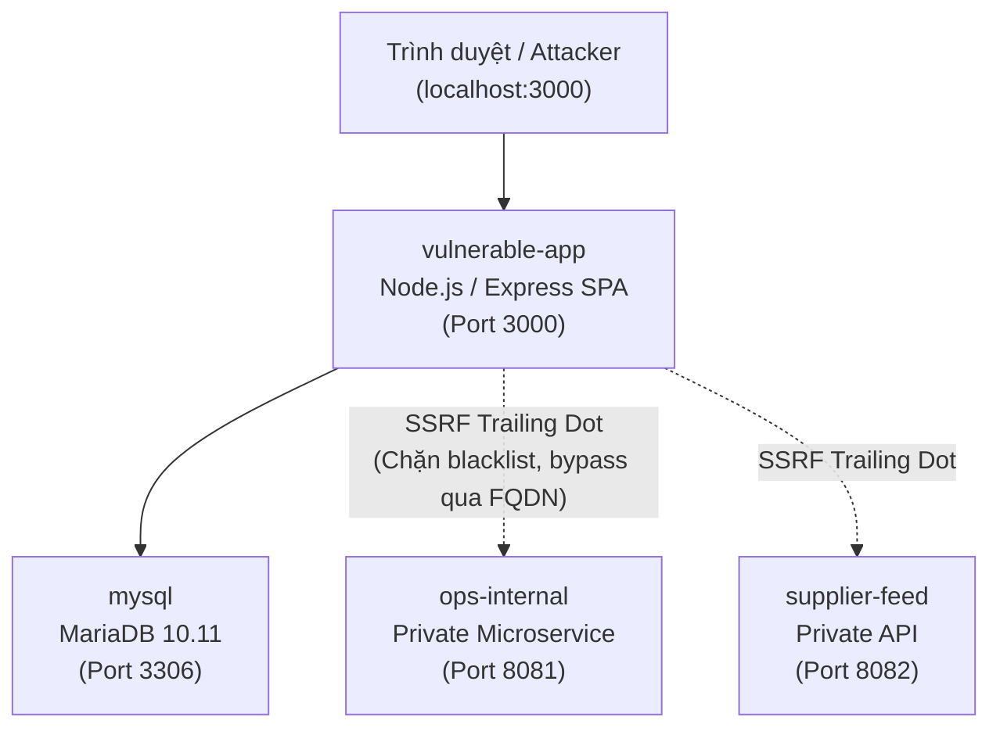

# ☕ BrewCart — Web Security Practice Lab (PortSwigger Academy Mapped)

Môi trường thực hành và kiểm thử bảo mật ứng dụng web (Web Security Lab) hoàn chỉnh, độc lập và chạy hoàn toàn trên Docker Container. Hệ thống mô phỏng một ứng dụng thương mại điện tử chuyên cung cấp cà phê đặc sản, được tích hợp chuỗi **7 lỗ hổng bảo mật thực tế** được ánh xạ chính xác theo danh mục kiến thức của **PortSwigger Web Security Academy**.

---

## 🏗️ Kiến Trúc Hệ Thống Lab

Hệ thống được đóng gói hoàn chỉnh bằng Docker Compose với mạng nội bộ riêng biệt (`lab-net`):



| Dịch vụ Container | Cổng | Công nghệ | Vai trò & Mục đích |
|---|---|---|---|
| **vulnerable-app** | `3000` | Node.js, Express, Static SPA | Ứng dụng chính (Giao diện mua sắm, API giỏ hàng, bảng quản trị Admin) |
| **mysql** | `3306` | MariaDB 10.11 | Lưu trữ dữ liệu sản phẩm, tài khoản, đơn hàng và đánh giá |
| **ops-internal** | `8081` | Node.js Microservice | Dịch vụ nội bộ chứa biến môi trường và mã khóa bí mật `INTERNAL_API_TOKEN` |
| **supplier-feed** | `8082` | Node.js Microservice | Dịch vụ nhà cung cấp nội bộ chứa khóa API `supplier_api_key` |

---

## 🎯 Danh Sách 7 Lỗ Hổng Theo Chuẩn PortSwigger Web Security Academy

| # | Chủ Đề PortSwigger Academy | Dạng Lỗ Hổng Cụ Thể | Điểm Bị Ảnh Hưởng | Mức Độ |
|---|---|---|---|---|
| **1** | **Access Control Vulnerabilities** | Vertical privilege escalation & Mass assignment | `GET /api/member/users`<br>`PATCH /api/member/profile` | **Critical** |
| **2** | **Access Control (IDOR)** | Insecure direct object references trên đơn hàng & hóa đơn | `GET /api/member/orders/:id`<br>`GET /api/member/orders/:id/invoice` | **High** |
| **3** | **Server-Side Request Forgery** | SSRF với kỹ thuật bypass bộ lọc danh sách đen bằng Trailing Dot | `POST /api/admin/supplier-sync` | **Critical** |
| **4** | **SQL Injection** | Time-based blind SQL injection trên tham số lọc danh mục | `GET /api/store/products?category=...` | **High** |
| **5** | **File Upload Vulnerabilities** | Tải lên tệp HTML độc hại không giới hạn định dạng | `POST /api/member/support/tickets/:id/attachments` | **High** |
| **6** | **Cross-Site Scripting** | Stored XSS thực thi trong phiên duyệt bài của Quản trị viên | `POST /api/store/reviews` & Giao diện duyệt bài | **Critical** |
| **7** | **Business Logic Vulnerabilities** | Lỗ hổng xử lý nghiệp vụ khi nhập giá âm qua tệp dữ liệu CSV | `POST /api/admin/imports/csv` | **Medium** |

---

## 🔑 Tài Khoản Hệ Thống Có Sẵn

Database MariaDB được khởi tạo sẵn các tài khoản thử nghiệm:

* **Quản trị viên (Admin):** `admin@gmail.com` / `Admin123!` (Role: `admin`)
* **Khách hàng thông thường:** `huy@gmail.com` / `user123` (Role: `customer`)
* **Tài khoản kiểm thử:** `test@test.com` / `test123` (Role: `customer`)

---

## 🚀 Hướng Dẫn Cài Đặt & Chạy Lab Từ Đầu (Setup Quickstart)

### 1. Yêu Cầu Tiên Quyết
* Đã cài đặt [Git](https://git-scm.com/).
* Đã cài đặt [Docker](https://www.docker.com/) và [Docker Compose](https://docs.docker.com/compose/) (hoặc Docker Desktop trên Windows/macOS).
* (Tùy chọn) [Python 3.8+](https://www.python.org/) để chạy script kiểm thử tự động.

### 2. Tải Mã Nguồn Về Máy
```bash
git clone <URL_REPOSITORY_CỦA_BẠN>
cd Lab_CVE
```

### 3. Khởi Động Toàn Bộ Hệ Thống Bằng Docker Compose
Chạy lệnh sau tại thư mục gốc của dự án:

```bash
docker compose up -d --build
```

Lệnh này sẽ tự động:
1. Tạo mạng nội bộ `lab-net`.
2. Khởi tạo cơ sở dữ liệu MariaDB và nạp schema, dữ liệu mẫu từ `mysql/init.sql` và `mysql/seed.sql`.
3. Build và khởi động 2 microservice nội bộ `ops-internal` (port 8081) và `supplier-feed` (port 8082).
4. Khởi động máy chủ ứng dụng web `vulnerable-app` tại cổng 3000.

### 4. Kiểm Tra Trạng Thái Container
```bash
docker compose ps
```
Khi thấy cả 4 container đều ở trạng thái `Up` (Running), hệ thống đã sẵn sàng hoạt động.

### 5. Truy Cập Ứng Dụng Web
Mở trình duyệt bất kỳ và truy cập:
👉 **`http://localhost:3000`**

---

## 🧪 Hướng Dẫn Kiểm Thử Tự Động (Automated Testing)

Trong thư mục dự án có sẵn script [test_lab.py](test_lab.py) giúp tự động kiểm tra toàn bộ 7 lỗ hổng và xác minh môi trường lab:

```bash
python test_lab.py
```

Kết quả trả về mẫu:
```text
=== 1. Test Broken Access Control ===
Status: 200 - Found 3 users (admin@gmail.com, huy@gmail.com, test@test.com)

=== 2. Test Mass Assignment ===
Before: Role = customer, Points = 100
After: Role = admin, Points = 88888 -> PRIVILEGE ESCALATION THÀNH CÔNG!

=== 3. Test SSRF Trailing Dot Bypass ===
Blocked host status: 502 (Chặn địa chỉ nội bộ)
Bypass (ops-internal.): {"APP_ENV":"production","INTERNAL_API_TOKEN":"ops_internal_9d4f21ac77e0"}

=== 4. Test IDOR on Orders ===
IDOR Order #10: Khách hàng Quản Trị Viên (Admin), Ghi chú bí mật: FLAG_VAULT_BREWCART_2026

=== 5. Test Time-based SQLi ===
SQLi response in 2.01s (Expected ~2s delay) -> XÁC NHẬN!

=== 6. Test Insecure File Upload / Stored XSS ===
Upload result: /uploads/exploit.html -> MIME text/html -> XÁC NHẬN!

=== 7. Test Review Submission & Admin Moderation ===
Submitted review status: pending
Admin approved review #10 -> Status: approved -> XÁC NHẬN!
```

---

## 📖 Báo Cáo Kỹ Thuật Chi Tiết (Writeup Report)

Báo cáo phân tích chuyên sâu định dạng HTML chuẩn phong cách Security Research đã được biên soạn sẵn:
* **[writeup.html](writeup.html)** (hoặc **[Bao_Cao_Phan_Tich_Lo_Hong_BrewCart.html](Bao_Cao_Phan_Tich_Lo_Hong_BrewCart.html)**)
* Chứa đầy đủ: Nguyên lý hoạt động, đoạn code dính lỗi, nhật ký kiểm thử, ảnh chụp màn hình minh chứng và hướng dẫn sửa lỗi (Remediation) chuẩn cho từng lỗ hổng.

---

## 🛠️ Các Lệnh Quản Trị Lab Hữu Ích

* **Xem log của ứng dụng web:**
  ```bash
  docker compose logs -f vulnerable-app
  ```
* **Khởi động lại một dịch vụ (ví dụ ứng dụng chính):**
  ```bash
  docker compose restart vulnerable-app
  ```
* **Tắt toàn bộ hệ thống lab:**
  ```bash
  docker compose down
  ```
* **Xóa sạch và đặt lại cơ sở dữ liệu từ đầu (Reset Data):**
  ```bash
  docker compose down -v
  docker compose up -d
  ```

---

## ⚠️ Lưu Ý An Toàn (Disclaimer)
Mã nguồn này được thiết kế và xây dựng **duy nhất cho mục đích nghiên cứu, học tập và diễn tập an toàn thông tin** trong môi trường cô lập nội bộ. Không sử dụng các kỹ thuật hoặc đoạn mã này để tấn công bất kỳ hệ thống nào khi chưa được phép bằng văn bản.
